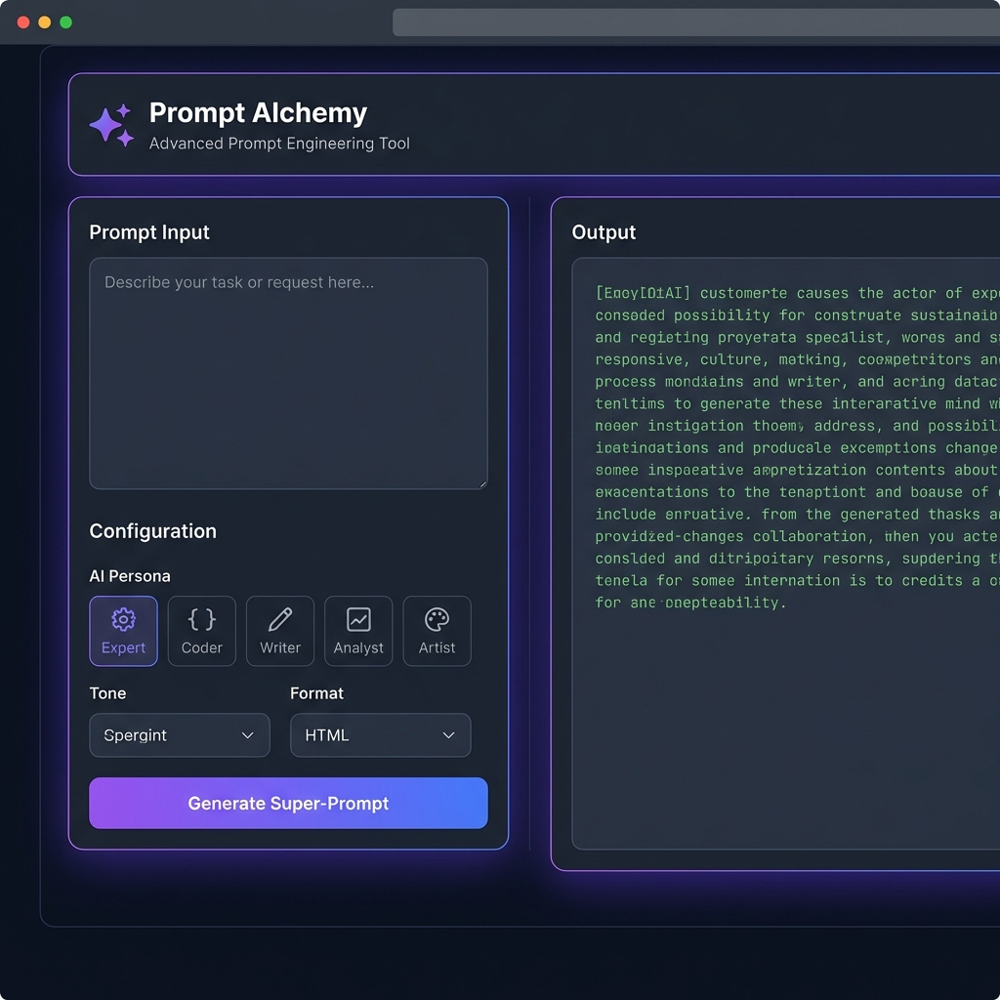

# 🪄 Prompt Alchemy - Free AI Prompt Generator

[](https://webdevservices.in/tools/free-prompt-generator/)
[](LICENSE)
[](https://github.com/MrPawanMall)

> **Transform simple ideas into powerful AI prompts** — A free, browser-based prompt engineering tool for ChatGPT, Gemini, coding assistants, and AI image generators.



## ✨ Features

- 🎯 **5 AI Personas** - Expert, Coder, Writer, Analyst, Artist
- 🎨 **Multiple Tones** - Professional, Friendly, Academic, Witty, and more
- 📝 **8+ Output Formats** - Markdown, JSON, HTML, Python Script, Tables, etc.
- 🔧 **Complexity Levels** - Basic, Intermediate, Advanced
- 💾 **Local History** - Saves your last 10 prompts (browser storage)
- 🌓 **Dark/Light Mode** - Beautiful UI with smooth theme switching
- ⚡ **100% Client-Side** - No server required, works offline
- 📱 **Responsive Design** - Works on desktop, tablet, and mobile

## 🚀 Live Demo

**Try it now:** [https://webdevservices.in/tools/free-prompt-generator/](https://webdevservices.in/tools/free-prompt-generator/)

## 🎯 Use Cases

- ✅ Create optimized prompts for **ChatGPT** and **Gemini**
- ✅ Generate clean **coding prompts** for developers
- ✅ Write **creative and academic** content prompts
- ✅ Produce **AI image generation** prompts (Midjourney, DALL-E, Stable Diffusion)
- ✅ Help beginners learn **prompt engineering** best practices

## 🛠️ Installation

### Option 1: Direct Download

1. Download `index.php` (or rename to `index.html`)
2. Open in any modern web browser
3. Start generating prompts!

### Option 2: Clone Repository

```bash
git clone https://github.com/MrPawanMall/Prompt-Alchemy---Free-AI-Prompt-Generator.git
cd Prompt-Alchemy---Free-AI-Prompt-Generator
```

Then open `index.php` in your browser.

### Option 3: Use with Local Server

```bash
# Using Python
python -m http.server 8000

# Using PHP
php -S localhost:8000

# Using Node.js (with http-server)
npx http-server
```

Visit `http://localhost:8000` in your browser.

## 📖 How to Use

1. **Enter Your Idea** - Type your basic task or concept
2. **Select AI Persona** - Choose Expert, Coder, Writer, Analyst, or Artist
3. **Configure Settings** - Pick tone, output format, and complexity
4. **Add Context** (Optional) - Provide background info or constraints
5. **Generate** - Click "Generate Super-Prompt" and copy the result!

## 🎨 Screenshots

### Dark Mode (Default)

The tool features a modern dark interface with indigo/violet gradients.

### Light Mode

Switch to light mode for comfortable daytime use.

## 🧩 Tech Stack

- **HTML5** - Semantic markup
- **Tailwind CSS** - Utility-first styling (CDN)
- **Vanilla JavaScript** - No frameworks, pure JS
- **Font Awesome** - Icons
- **Google Fonts** - Inter & Fira Code

## 📂 Project Structure

```
free-prompt-generator/
├── index.php           # Main application file
├── README.md          # This file
├── LICENSE            # MIT License
├── .gitignore         # Git ignore rules
├── CONTRIBUTING.md    # Contribution guidelines
└── screenshot.png     # Preview image
```

## 🤝 Contributing

Contributions are welcome! Please read [CONTRIBUTING.md](CONTRIBUTING.md) for details on our code of conduct and the process for submitting pull requests.

### Quick Start for Contributors

1. Fork the repository
2. Create your feature branch (`git checkout -b feature/AmazingFeature`)
3. Commit your changes (`git commit -m 'Add some AmazingFeature'`)
4. Push to the branch (`git push origin feature/AmazingFeature`)
5. Open a Pull Request

## 🐛 Bug Reports & Feature Requests

Found a bug or have an idea? [Open an issue](https://github.com/MrPawanMall/Prompt-Alchemy---Free-AI-Prompt-Generator/issues)!

## 📜 License

This project is licensed under the **MIT License** - see the [LICENSE](LICENSE) file for details.

## 👨‍💻 Author

**Pawan Mall**

- GitHub: [@MrPawanMall](https://github.com/MrPawanMall)
- Website: [WebDev Services](https://webdevservices.in)

## 🌟 Show Your Support

If this tool helped you, please give it a ⭐ on GitHub!

## 🙏 Acknowledgments

- Built with modern web standards
- Inspired by the AI prompt engineering community
- Part of the [WebDev Services](https://webdevservices.in) toolkit

## 📊 SEO Keywords

`free ai prompt generator`, `prompt engineering tool`, `chatgpt prompts`, `gemini prompts`, `ai tools 2025`, `prompt optimizer`, `ai prompt builder`, `free prompt creator`

---

**Made with ❤️ by [Pawan Mall](https://github.com/MrPawanMall) | [WebDev Services](https://webdevservices.in)**
